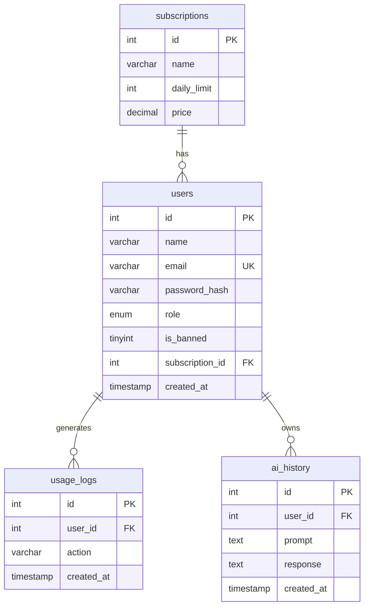

# AI SaaS — MySQL Database Schema

## Entity relationship overview



**Cardinality**

| Parent          | Child        | Relationship | Meaning                          |
|-----------------|--------------|--------------|----------------------------------|
| `subscriptions` | `users`      | 1 : N        | One plan, many users             |
| `users`         | `usage_logs` | 1 : N        | One user, many usage events      |
| `users`         | `ai_history` | 1 : N        | One user, many AI conversations  |

---

## 1. `subscriptions`

Catalog of subscription tiers. Users reference one row via `users.subscription_id`.

| Column        | Type              | Keys   | Notes                              |
|---------------|-------------------|--------|------------------------------------|
| `id`          | INT UNSIGNED      | **PK** | Auto-increment                     |
| `name`        | VARCHAR(50)       |        | e.g. Free, Pro, Premium            |
| `daily_limit` | INT UNSIGNED      |        | Max AI requests per calendar day   |
| `price`       | DECIMAL(10,2)     |        | Monthly price (mock billing)     |

**Primary key:** `id`

**Example data**

| id | name    | daily_limit | price  |
|----|---------|-------------|--------|
| 1  | Free    | 20          | 0.00   |
| 2  | Pro     | 100         | 9.99   |
| 3  | Premium | 500         | 29.99  |

---

## 2. `users`

Registered accounts with auth credentials, role, ban flag, and current plan.

| Column            | Type              | Keys        | Notes                                |
|-------------------|-------------------|-------------|--------------------------------------|
| `id`              | INT UNSIGNED      | **PK**      | Auto-increment                       |
| `name`            | VARCHAR(100)      |             | Display name                         |
| `email`           | VARCHAR(255)      | **UNIQUE**  | Login identifier                     |
| `password_hash`   | VARCHAR(255)      |             | bcrypt via `password_hash()`         |
| `role`            | ENUM('user','admin') |          | Default `user`                       |
| `is_banned`       | TINYINT(1)        |             | `1` = blocked from login             |
| `subscription_id` | INT UNSIGNED      | **FK** → `subscriptions.id` | Current plan |
| `created_at`      | TIMESTAMP         |             | Account creation time                |

**Primary key:** `id`  
**Foreign key:** `subscription_id` → `subscriptions(id)`

**Indexes (recommended)**

- `UNIQUE (email)` — fast login lookup, no duplicate emails

**Example data**

| id | name   | email              | role  | is_banned | subscription_id | created_at          |
|----|--------|--------------------|-------|-----------|-----------------|---------------------|
| 1  | Admin  | admin@example.com  | admin | 0         | 3               | 2026-05-01 10:00:00 |
| 2  | Alice  | alice@example.com  | user  | 0         | 1               | 2026-05-10 14:30:00 |
| 3  | Bob    | bob@example.com    | user  | 0         | 2               | 2026-05-15 09:15:00 |
| 4  | Carol  | carol@example.com  | user  | 1         | 1               | 2026-05-18 16:45:00 |

---

## 3. `usage_logs`

Append-only audit of billable or notable actions. Daily AI limits are enforced by counting rows where `action = 'ai_request'` and `DATE(created_at) = CURDATE()`.

| Column       | Type         | Keys   | Notes                                      |
|--------------|--------------|--------|--------------------------------------------|
| `id`         | INT UNSIGNED | **PK** | Auto-increment                             |
| `user_id`    | INT UNSIGNED | **FK** → `users.id` | Who performed the action      |
| `action`     | VARCHAR(50)  |        | e.g. `ai_request`, `plan_upgrade`          |
| `created_at` | TIMESTAMP    |        | When the event occurred                    |

**Primary key:** `id`  
**Foreign key:** `user_id` → `users(id)` ON DELETE CASCADE

**Indexes**

- `idx_user_date (user_id, created_at)` — fast daily usage counts per user

**Example data**

| id | user_id | action       | created_at          |
|----|---------|--------------|---------------------|
| 1  | 2       | ai_request   | 2026-05-22 08:01:00 |
| 2  | 2       | ai_request   | 2026-05-22 08:15:00 |
| 3  | 2       | plan_upgrade | 2026-05-20 12:00:00 |
| 4  | 3       | ai_request   | 2026-05-22 09:30:00 |
| 5  | 3       | ai_request   | 2026-05-22 10:00:00 |

---

## 4. `ai_history`

Stored prompts and model responses for the user dashboard and auditing.

| Column       | Type         | Keys   | Notes                    |
|--------------|--------------|--------|--------------------------|
| `id`         | INT UNSIGNED | **PK** | Auto-increment           |
| `user_id`    | INT UNSIGNED | **FK** → `users.id` | Owner of the record |
| `prompt`     | TEXT         |        | User input               |
| `response`   | TEXT         |        | AI output                |
| `created_at` | TIMESTAMP    |        | Request timestamp        |

**Primary key:** `id`  
**Foreign key:** `user_id` → `users(id)` ON DELETE CASCADE

**Indexes**

- `idx_user_created (user_id, created_at DESC)` — recent history per user

**Example data**

| id | user_id | prompt                         | response (truncated)     | created_at          |
|----|---------|--------------------------------|--------------------------|---------------------|
| 1  | 2       | Summarize agile in 3 bullets   | 1. Iterative delivery…   | 2026-05-22 08:01:00 |
| 2  | 2       | Write a welcome email          | Subject: Welcome…        | 2026-05-22 08:15:00 |
| 3  | 3       | List 5 blog post ideas         | 1. AI in education…      | 2026-05-22 09:30:00 |

---

## Common queries

**Today's AI usage for a user**

```sql
SELECT COUNT(*) AS used_today
FROM usage_logs
WHERE user_id = ?
  AND action = 'ai_request'
  AND DATE(created_at) = CURDATE();
```

**User profile with plan limits**

```sql
SELECT u.*, s.name AS plan_name, s.daily_limit, s.price
FROM users u
JOIN subscriptions s ON s.id = u.subscription_id
WHERE u.id = ?;
```

**Recent AI history**

```sql
SELECT id, prompt, response, created_at
FROM ai_history
WHERE user_id = ?
ORDER BY created_at DESC
LIMIT 10;
```

---

## Design decisions

| Decision | Rationale |
|----------|-----------|
| Separate `subscriptions` table | Plans are shared; change limits/prices in one place |
| `usage_logs` vs counting `ai_history` | Logs support multiple action types and lightweight counting |
| `ON DELETE CASCADE` on child tables | Removing a user cleans logs and history |
| `INT UNSIGNED` PKs | Sufficient range for a small/medium SaaS |
| No soft-delete on users | Ban via `is_banned`; keeps schema simple |

---

## Files in this repo

| File | Purpose |
|------|---------|
| `schema.sql` | Runnable DDL + seed data |
| `docs/database-schema.md` | This design reference |
